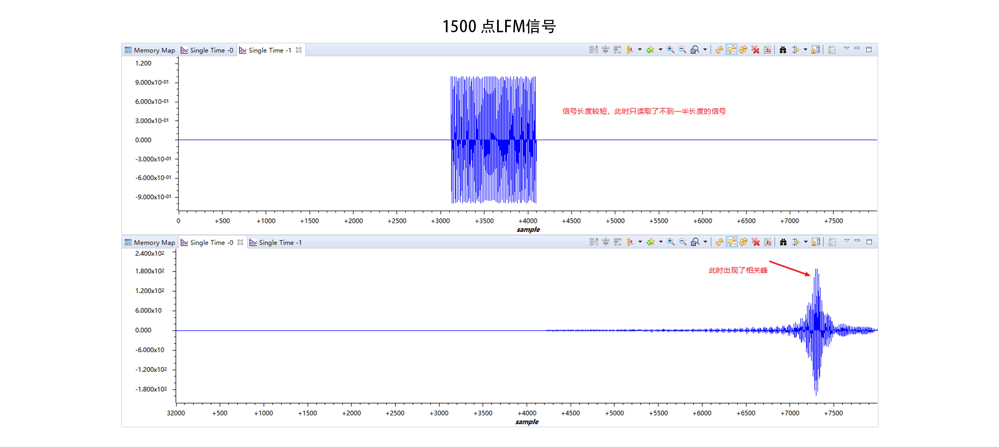
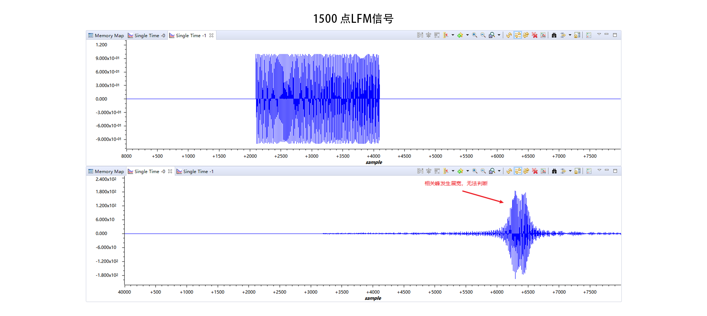
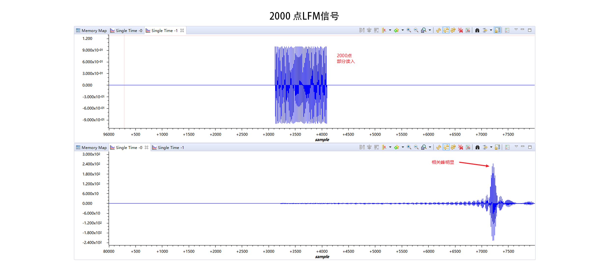
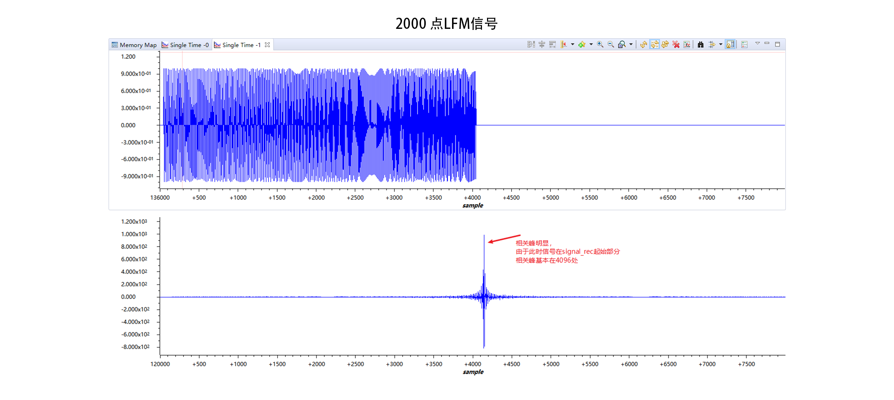
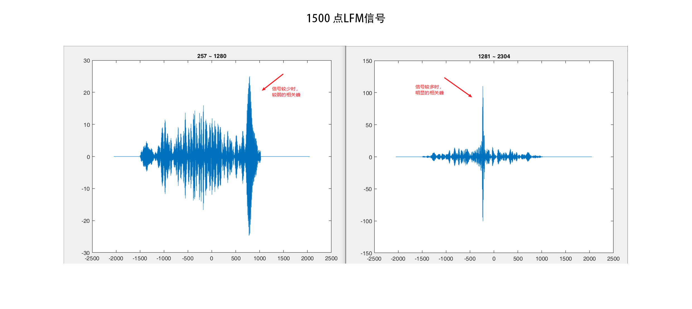

# 调试问题
现有的运算中，采用了LFM信号长度为20ms，在100kHz的采样率下是200个点。在程序中，同时也生成了长度为2000点的LFM信号，不管是MATLAB程序还是CCS程序，其运算结果都会出现尖锐的相关峰。

现有的问题是，在CCS中采用低于2000点的信号长度时，会出现峰值展宽的现象，目前尝试的有1800，1500，1000点。1800点会有明显的峰值，但是1500点和1000点峰值已经展宽，无法判断信号的起始位置。

而在MATLAB中仿真时，不管是多少点都会有非常明显的峰值产生。

### CCS运算结果

#### 1500点LFM

#### 2000点LFM

### matlab 运算结果

#### 1500点LFM

#### 2000 点LFM

### 想法

如果从时域的相关运算过程去分析，信号在平移累加的过程中，因为长短不一致，确实有可能会出现对称峰值的情况，这种思路符合CCS的仿真结果，但是同样的思路放入到频域分析就有点奇怪，因为频域的运算原理是对FFT之后的两个值做乘法，那么因为两个信号的频谱在不考虑干扰的情况下是一致的，也就是在频域两者的长度时对其的，运算只会增加LFM的频率位置的强度，在随后的ifft中应该也是能够出现峰值的，这个是符合MATLAB的仿真结果的。